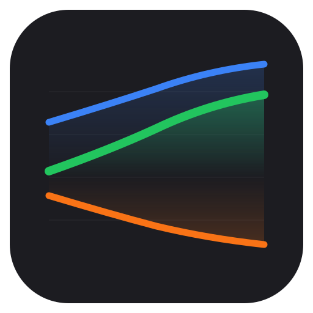
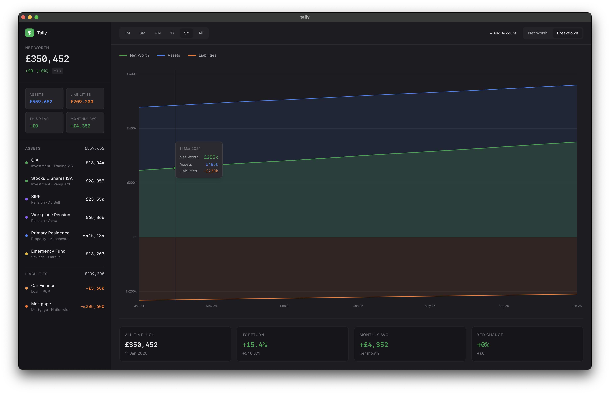

  

<h1 align="center">Tally</h1>

  An aggressively straightforward way to monitor your finances.

---

A local ~first~ only finance app built to be what I want - simple. Maybe you'll like it too, maybe you won't.

  

## Ethos

Tally is designed around a "get in, get out" philosophy. You shouldn't spend time with your head buried in a finance app. Open it once a month, punch in your latest balances, glance at the chart, and move on.

## Installation

Download the latest release from the [Releases](../../releases) page.

## Development

See the [app](./app) directory for development setup and technical details.

## License

MIT
